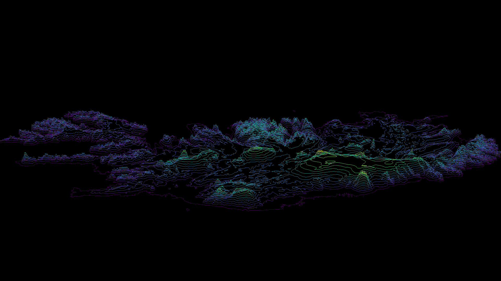

# Iceland Visualization

A geospatial visualization of Iceland.

Uses a Digital Elevation Model (DEM) for the topography, shapefiles for waterways and roads, and a raster dataset for the population centers.

## Use

The session file can be loaded in to VisIt, at which point the python script can be inserted and ran. 

Note: depending on your hardware, visualizing and rendering can take many hours. To save time, I created a  to show the final product. 

## Development

Uses a Digital Elevation Model (DEM) for the topography, shapefiles for waterways and roads, and a raster dataset for the population centers.

The 2D datasets are scaled to 3D using the DEM's height values.

Video compiled with ffmpeg.

Dependencies: 
- Python 2
- C++ Visualization ToolKit (VTK)
- VisIt 

## Author

Noah Tigner

nzt@cs.uoregon.edu